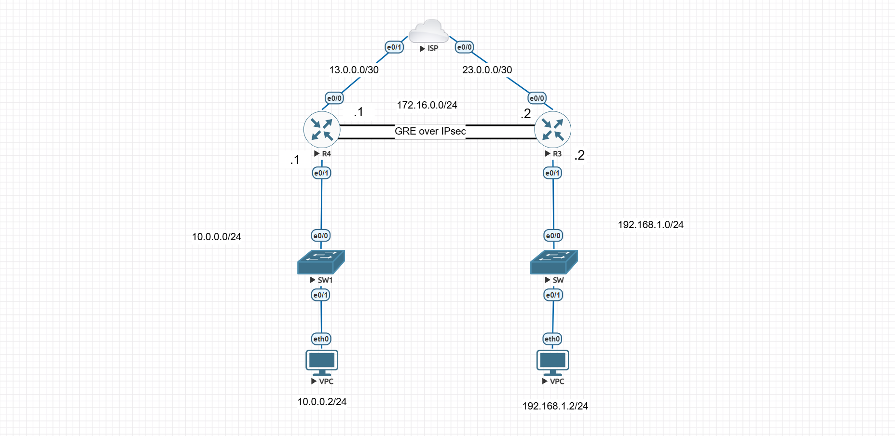

# GRE over IPsec Site-to-Site VPN Lab (EVE-NG)

This lab demonstrates how to build a **GRE-over-IPsec** site-to-site VPN between two routers in EVE-NG, with dynamic routing (EIGRP) running over the GRE tunnel.

---

## 🔍 Lab Topology

- Two routers (R3 and R4) connected via a “cloud / ISP” network  
- GRE tunnel configured over IPsec between R3 and R4  
- LAN behind R3: `192.168.1.0/24`  
- LAN behind R4: `10.0.0.0/24`  
- Tunnel interface: `172.16.0.0/24`  

*(See `GRE over IPsec S2S VPN.unl` for the exact EVE-NG lab file.)*

---

## 🎯 Objectives / Tasks

In this lab, you will:

1. Configure IP addressing on both routers and on their LAN interfaces.  
2. Create a **GRE tunnel** between R3 and R4 using the `172.16.0.0/24` network.  
3. Configure **IPsec**:  
   - ISAKMP (phase 1) policy  
   - Transform-set (phase 2)  
   - Profile, and apply the profile to the GRE tunnel interface  
4. Implement **EIGRP** over the GRE tunnel for dynamic routing between the two LANs.  
5. Verify end-to-end connectivity and troubleshoot if necessary.

---

## 📂 Configuration Files

- `R3.txt` — Router R3 Configuration file.    
- `R4.txt` — Router R4 Configuration file.  

---

## 🚀 How to Use This Lab

1. Import `GRE over IPsec S2S VPN.unl` into your EVE-NG environment.  
2. Deploy the nodes (routers, switches, VPCs) according to the topology.

---

## ✅ Validation / Verification

You should confirm:

- The GRE tunnel comes up (`show ip interface brief`, `show ip eigrp neighbors`, etc.).  
- IPsec is established (`show crypto isakmp sa`, `show crypto ipsec sa`).  
- LAN subnets can ping each other across the tunnel.  
- EIGRP routes are learned on both sides (`show ip route eigrp`).

---

## 📚 References

- [Eng. Mohamed Elhady]([YouTube channel](https://www.youtube.com/@CCNA-CCNP-CCIE-Mohamed.Elhady) — for lab setup tips.  

---

